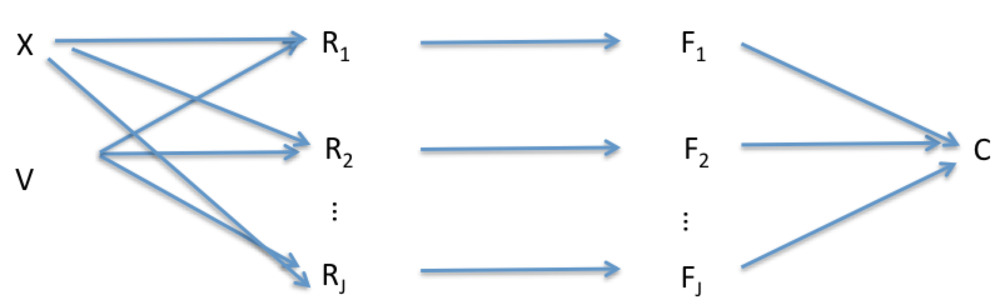

```{r setup, include=FALSE}
knitr::opts_chunk$set(echo=FALSE)
library(ggplot2)
```

# Introduction

I believe this model captures a general feature of  many data sets that will be arising during vaccine trials. We have an outcome measure, a high-dimensional (here 12, but in the future 1000s [@Hagan2015]) list of immune correlates of that outcome measure, probably only a small number of which are surrogates. The unique thing about this data set is that we have a strong biological reason to think that there is only one surrogate for protection, and a lot of correlates that are not surrogates. The specific question here is to model the system we have in front of us, but the more general motivation is to develop approaches for identifying real surrogates statistically.

Previous work has dealt with some aspects of the problem. Without considering the immune response, Mehtala et al. [-@Mehtala2016] have looked at the multiple-serotype estimation of vaccine efficacy, a framework on which we would build [@Mehtala2016]. Dagan et al. [@Dagan2005] have shown that serotype-specific antibody measurements correlate with vaccine-induced protection against that serotype [@Dagan2005], and a new analyss showing the same thing in another dataset is in press. We (poster presentation ISPPD 2016) showed strong correlations among the immune responses to different serotypes in vaccinated individuals. The new work to be done would be:

1. Set up an inference framework that generalizes [@Mehtala2016] to include simultaneous inference of the vaccine efficacy distribution and the impact of serotype-specific vaccine immunogenicity on vaccine efficacy
2. Compare this estimation to the separate estimation of serotype-specific VE [@Mehtala2016] and predictors of VE [@Dagan2005]. Does this improve efficiency or reduce bias for either of the estimands? In particular the approach of [@Dagan2005] probably underestimates the magnitude of the correlation between serotype-specific immune response Rj and serotype-specific efficacy because serotype-specific response Rj is positively correlated with other serotype-specific responses Rk, which are negatively correlated with hazards Fk, which compete with the outcome C=j – thus people who have strong immune responses are more protected against all serotypes, but since the serotypes are competing risks the effect of immune response on any individual serotype will be attenuated by correlated effects on competing serotypes.
3.	Assess whether the inference method can “tell” that serotype-specific measurements are surrogates while other serotype-specific responses are only correlates
4.	Assess whether (due to measurement error) a summary of all-serotype responses is more predictive of protection than is serotype-specific response (because the former has less measurement error).
5.	Consider ways to generalize this to other ways of measuring the outcome (directly measuring hazard or risk, vs. this complex outcome that is a composite due to competition between the serotypes)
 


# Method

## Data

A vaccine trial with vaccination vs J different serotypes (J-valent vaccine) randomized, antibodies measured and then followup to see which if any serotype colonizes the person.

## Simulations

```{r generate_simulations}

```


## Model

For each participant i there is a vaccine status $V_i$ (0/1), a set of immune responses $R_{ij}$ (antibodies to serotype j), a "hazard of colonization" $F_{ij}$ (nonnegative) and an outcome   which is the serotype (if any) with which the individual is colonized at some follow up time (there may be more than one followup time, but we ignore that here). There is also a patient-specific "immune responsiveness" $X_i$  that affects the immune response to all serotypes.



Importantly, the only direct causal arrows from the immune response R to the outcomes hazard F are are serotype-specific: antibody to one serotype can suppress risk of acquieing that serotype, but not of other serotypes (by assumption, very likely true). The colonization state of the individual at followup may be modeled by a competing risk model: or perhaps better by the model in the paper by Mehtala et al. [-@Mehtala2016].  

If this model is true, then we have a surrogate of protection (the serotype-specific antibody measurement for each serotype specific hazard and we observe the colonization status which informs us about these hazards. We also have a number of correlates of protection, which are not causal for hazard but may be correlated with it  because of their common cause Xi, the subject’s immune responsiveness (we have analyzed just the $R_{ij}$ and seen that responses are very positively correlated across serotypes within an individual).


# Bibliography
